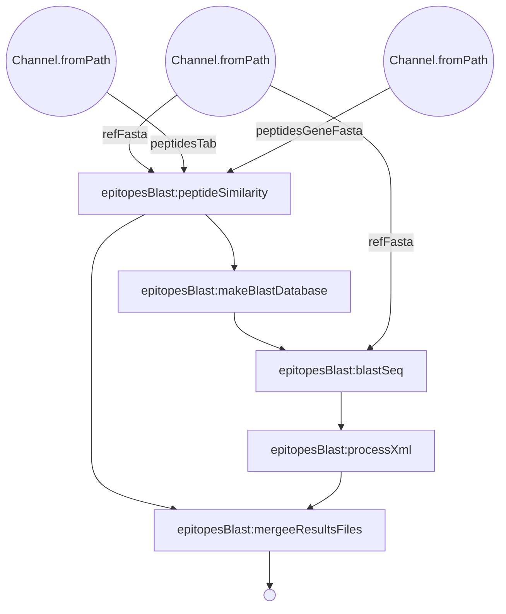

# Immune Epitope analyses
This repository contains scripts and processes for the identification of genes whose protein products show similarity to epitopes identified by  Immune Epitope Database and Analysis Resource (IEDB).

The analysis begin with processing of the Epitopes talking a tab file containing the Epitopes and reference proteome. The first step identify epitopes that have exact match in the reference proteome and weather the gene source of the epitope is identical to the reference protein in the proteome. At this step a fasta file of the epitopes is generated to blast against the reference proteome. 

The Second step use Blast to identify hit of the Epitopes in the reference proteome. Default blast option is NCBI plastp and user can set blast to diamond in the nextflow config file. The blast is perform only in cases where the epitope source taxon agree with the reference taxa. 

The steps in the nextflow graph is shown below. 

***
Nextflow workflow
*** 

